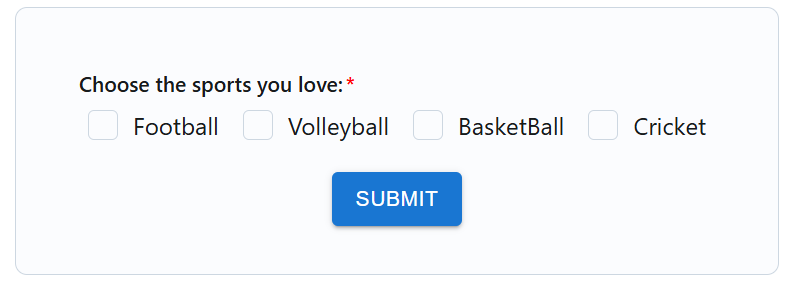
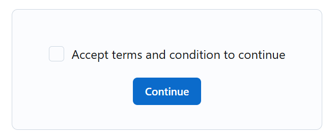
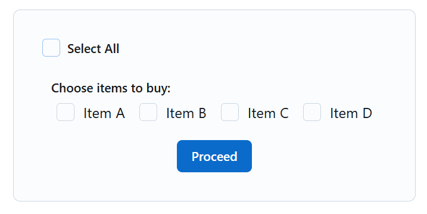
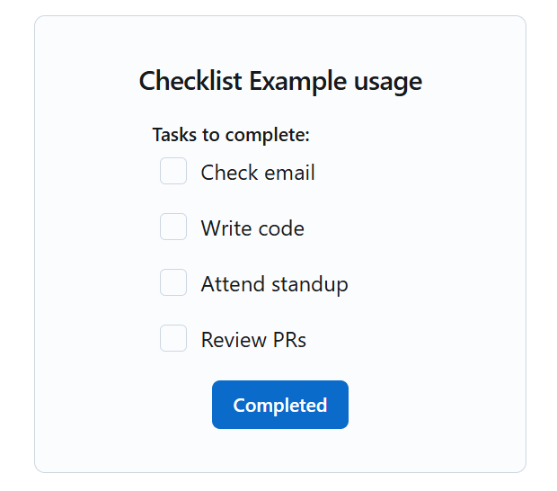
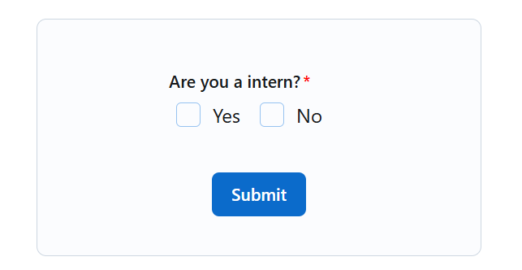
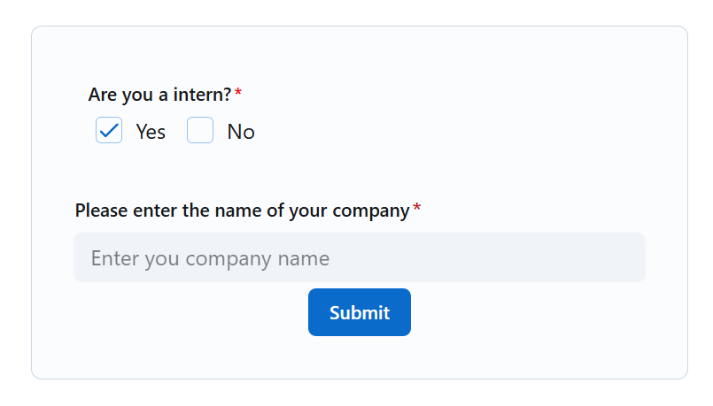
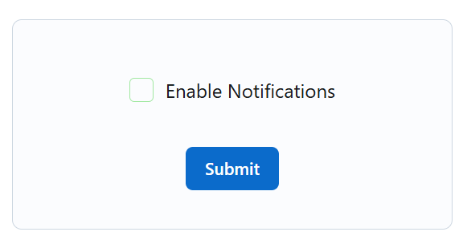

Checkboxes give users binary choices when presented with multiple options in a series.

## Introduction

[Checkboxes](./checkbox.md) provide users with a graphical representation of a binary choice (yes or no, on or off, etc). We have created ways to handle checkbox operations using `formik-form-builder`. To make it a checkbox, use type: `InputTypes.CHECKBOX`.

---
## Usage
Checkbox input type allows you to create multiple checkbox options tied to a single field, typically representing a multi-select scenario.

*Each checkbox group is controlled by a field configuration object:*
 - `field`: The name of the variable that holds the data.
 - `type`: To specify the type of input we want to use.
 - `initialValue`: To provide initial/default value. 
 - `direction`: To specify the direction of the option items.
 - `helperText` : To provide more information about it.
 - `groupLabel`: To provide label for that particular input group.
 - `validation`: To give validation like `required`, `message`, `minLength`, etc. Pass it as an object. See more at [validation](checkbox.md).
 - `options`: Options an array of object is required which will have a `label` (what the user sees) and `value` (what gets submitted) and a `description`(descrption about the option).
 - `valueType`: to specify the type of value it will be used.(import CHECK_BOX_VALUE_TYPE)
 - `muiProps`: You can pass all [mui](https://mui.com/joy-ui/react-checkbox/) props that is available for this type.

## Examples

Let us see some of the ways how can use checkbox using `formik-form-builder`.

### Basic toggle Checkbox

A checkbox when you need to present multiple options and expect the user to select one or more of them. It’s useful for capturing preferences, eligibility, or any multi-choice input. Making it required ensures the user engages with the field before submitting.


```tsx
{
  field: "sport",
  type: InputTypes.CHECKBOX,
  initialValue: [],
  groupLabel: "Choose the sports you love:",
  validation: {
    required: true,
    minLength:1,
    minLengthRuleMsg:"Choose atleast one sport"
   },
  options: [
    { label: "Football", value: "Football"},
    { label: "Volleyball", value: "Volleyball"},
    { label: "BasketBall", value: "BasketBall"},
    { label: "Cricket", value: "Cricket"},
    ],
  muiProps:{variant:"outlined"}
},
```
### Agreement Checkbox

Checkbox for single-option like accepting terms and conditions, switch, etc. It acts as a required toggle — the form won’t submit unless the user checks it. Ideal for confirmations, consent, or any “I agree” action. Clean, declarative, and easily styled via MUI props.



```tsx
{
  field: "termAcceptence",
  type: InputTypes.CHECKBOX,
  initialValue: [],
  validation: {
    required: true,
    minLength: 1,
    minLengthRuleMsg: "Accept terms and condition to continue",
      },
  options: [
    { label: "Accept terms and condition to continue", value: "Accepted" },
    ],
  muiProps: { variant: "outlined" },
},
```
### Bulk Selection
Checkbox for bulk selections where users can choose multiple items from a list — like selecting products, categories, or preferences. It's ideal for use cases where multi-choice input is needed, with each selection tracked under the same field. The vertical layout and MUI props keep it flexible and styled.



```tsx
{
  field: "bulkSelecting",
  type: InputTypes.CHECKBOX,
  initialValue: [],
  groupLabel: "Choose items to buy:",
  options:itemOptions,
  muiProps: { variant: "outlined" },
},
```
You will need more that just the config above as shown below:
```tsx
// this an example of how you can us it(use according to how it fit ur project) 
const itemOptions = [
  { label: "Item A", value: "Item A" },
  { label: "Item B", value: "Item B" },
  { label: "Item C", value: "Item C" },
  { label: "Item D", value: "Item D" },
];
// Declare this after the config object
const allValues = itemOptions.map((opt) => opt.value);
//  Inside formik you need to use it like this with the layout changes you want to make
{({ values, setFieldValue }) => {
  const isAllSelected = values.bulkSelecting?.length === itemOptions.length;
  const toggleSelectAll = () => {setFieldValue("bulkSelecting", isAllSelected ? [] : allValues)};

return (
  <Form>
    <FormControl orientation="horizontal" sx={{ mb: 2 }}>
      <Checkbox checked={isAllSelected}
                onChange={toggleSelectAll}
                variant="outlined"
                color="primary"
            />
        <FormLabel sx={{ ml: 1, fontWeight: 500 }}>Select All</FormLabel>
    </FormControl>
    <FormBuilder group="form"  
        fields={bulkSelect} 
        data-test="form" 
        values={values}
      />
      <Box
        width={"100%"}
        display={"flex"}
        justifyContent={"center"}
        alignItems={"center"}
        >
          <Button variant="solid" type="submit">
            Proceed
          </Button>
      </Box>
  </Form>
  );
  }}
</Formik>
```

### To-Do List
This checkbox group is suited for task or checklist-style inputs where users can mark multiple actions as selected. It works well for to-do lists, progress tracking, or any form that needs multiple step confirmations. The column layout ensures clarity, and MUI props handle the styling.



```tsx
{
  field: "tasks",
  type: InputTypes.CHECKBOX,
  initialValue: [],
  direction: "column",
  groupLabel: "Tasks to complete:",
  options: [
    { label: "Check email", value: "email" },
    { label: "Write code", value: "code" },
    { label: "Attend standup", value: "standup" },
    { label: "Review PRs", value: "review" },
      ],
  muiProps: { variant: "outlined" },
},
```

### Conditional Checkbox
This pattern is used when one field controls the visibility of another based on the user's response. A checkbox group collects a yes/no or multi-option answer, and a related input field appears conditionally if a specific value is selected. It’s useful for creating dynamic, context-aware forms that respond to user input. Refer [Conditional Logic](checkbox.md).

**Defaut:**


**When condition is fulfilled:** 


```tsx
{
  field: "isIntern",
  type: InputTypes.CHECKBOX,
  initialValue: "",
  groupLabel: "Are you a intern?",
  validation: {
    required: true,
    minLength: 1,
    minLengthRuleMsg: "required",
    maxLength: 1,
    maxLengthRuleMsg: "Please select either yes or no",
     },
  options: [
        { label: "Yes", value: "yes" },
        { label: "No", value: "no" },
      ],
  muiProps: { variant: "outlined", color: "primary" },
},

{
  field: "companyName",
  type: InputTypes.TEXT,
  label: "Please enter the name of your company",
  initialValue: "",
  validation: {
    required: true,
    message: "Required.",
      },
  conditions: {
    action: ConditionAction.SHOW,
    groups: [
      {
        group: "check",
        groupPostCondition: PostCondition.AND,
        logic: [
          {
            field: "isIntern",
            value: "yes",
            condition: ConditionName.INCLUDES,
            postCondition: PostCondition.AND,
            },
          ],
      },
    ],
  },
  muiProps: { placeholder: "Enter you company name" },
},
```

### Switch Checkbox
Checkbox used for optional preference settings, allowing users to customize their experience — like enabling features or toggling options. It’s ideal when the input is not mandatory but enhances functionality or personalization.



``` tsx
{
  field: "notifications",
  type: InputTypes.CHECKBOX,
  initialValue: [],
  options: [
    {
      label: "Enable Notifications",
      value: "enabled",
    },
    ],
  muiProps: {
    variant: "outlined",
    color: "success",
    },
},
```
